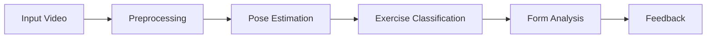

# 🏋️ GymbrAIn

> **AI-Powered Exercise Form Correction**  
> Real-time workout analysis using pose estimation and neural networks

An intelligent system that analyzes workout videos, identifies exercise types, and provides corrective feedback by comparing user form against expert references through joint angle analysis.

---

## 🎯 What This Does

GymbrAIn processes workout videos to:

- ✅ **Classify exercises** - Bench press, lat pulldown, barbell biceps curl, tricep pushdown
- 🦴 **Extract skeletal data** - 17 keypoints per frame for pose tracking
- 📊 **Compare form** - User execution vs. expert references
- 🔍 **Analyze angles** - Calculate joint angle differences and flag errors

**Performance**: 80% classification accuracy using GRU with self-attention mechanisms

---

## ⚡ Technical Highlights

### Pose Estimation & Computer Vision
- **[YOLOv8 Pose](https://github.com/ultralytics/ultralytics)** - 17 keypoints per frame for skeletal tracking
- **[OpenCV](https://opencv.org/)** preprocessing - Gaussian blur + sharpening kernels
- **[Camera calibration](https://docs.opencv.org/4.x/dc/dbb/tutorial_py_calibration.html)** - Zhang's method for 2D→3D joint angles

### Neural Networks & ML
- **[Keras/TensorFlow](https://www.tensorflow.org/)** - GRU with self-attention layers
- **Temporal sequence classification** - 256 neurons, 0.25 dropout
- **Reference retrieval** - Normalized pose embeddings via L2 norm

### Video Processing
- **[MoviePy](https://zulko.github.io/moviepy/)** - Clip extraction and frame sampling
- **Velocity minima detection** - [L2 norm](https://developer.mozilla.org/en-US/docs/Web/JavaScript/Reference/Global_Objects/Math/hypot) calculations for rep boundaries

---

## 📦 Libraries & Dependencies

<table>
<tr>
<td width="50%" valign="top">

**Core ML/CV Stack**
- [Ultralytics YOLOv8](https://github.com/ultralytics/ultralytics)
- [TensorFlow/Keras](https://www.tensorflow.org/)
- [OpenCV](https://opencv.org/)
- [PyTorch](https://pytorch.org/)

</td>
<td width="50%" valign="top">

**Video & Data Processing**
- [MoviePy](https://zulko.github.io/moviepy/)
- [NumPy](https://numpy.org/)
- [Matplotlib](https://matplotlib.org/)
- [Pillow](https://python-pillow.org/)

</td>
</tr>
</table>

---

## 📁 Project Structure

```
.
├── camera_coeffs/          # Camera calibration matrices per exercise
├── videoTest/              # User workout videos for testing
├── videoLuca/              # Reference execution videos
│   ├── frames/             # Pre-extracted reference frames
│   └── video_720/          # 720p reference videos
├── deep_learning.py        # Pose estimation & classification
├── geometry.py             # Angle calculation & calibration
├── main.py                 # Main execution pipeline
├── utils.py                # Helper functions & visualization
├── video_processing.py     # Video preprocessing
├── poses5.json             # Pre-computed pose data
├── poses_finale.json       # Normalized pose embeddings
└── model_att.keras         # Trained GRU model (not in repo)
```

### 📂 Key Directories

| Directory | Purpose |
|-----------|---------|
| [`camera_coeffs/`](camera_coeffs/) | Calibration coefficients (camera matrix & distortion) for each exercise setup |
| [`videoLuca/`](videoLuca/) | Expert reference videos and extracted frames for form comparison |

---

## 🔄 How It Works



1. **Preprocessing** ([`video_processing.py`](video_processing.py))  
   Extract 5-second clip → Gaussian blur → Sharpening

2. **Pose Estimation** ([`deep_learning.py`](deep_learning.py))  
   YOLOv8 extracts 17 keypoints from 30 frames

3. **Classification** ([`deep_learning.py`](deep_learning.py))  
   GRU network with self-attention identifies exercise type

4. **Form Analysis** ([`geometry.py`](geometry.py))  
   Find rep boundaries → Retrieve reference → Calculate 3D angles → Compare

5. **Feedback** ([`utils.py`](utils.py))  
   Display angle differences and visual comparison

---

## 🧠 Model Architecture

| Component | Configuration |
|-----------|--------------|
| **Hidden Layers** | 256 neurons |
| **Dropout Rate** | 0.25 |
| **Attention** | Self-attention mechanisms |
| **Output** | 4-class softmax |
| **Accuracy** | 80% on test set |

📄 Training details and accuracy plots: [`Report_GymbrAIn.pdf`](Report_GymbrAIn.pdf)

---

## 🎓 Project Background

This project was developed by students at the **University of Modena and Reggio Emilia** as an academic exam project. The implementation builds on prior research comparing GRU, LSTM, and feedforward networks for fitness pose classification, with architectural improvements focusing on self-attention and optimized regularization.

**Authors**: Casali Cristian, Flotta Aldo, Lamberti Francesco

📚 **Full Documentation**:
- [`Report_GymbrAIn.pdf`](Report_GymbrAIn.pdf) - Technical report
- [`ppt_GymbrAIn.pdf`](ppt_GymbrAIn.pdf) - Presentation slides

---

## ⚠️ Limitations

- 🔧 Manual camera calibration required
- 📊 80% classification accuracy (room for improvement)
- 🏋️ Limited to 4 exercise types
- 📹 Dataset size constraints (400 videos total)

See Section 6.2 of the [report](Report_GymbrAIn.pdf) for future improvements.

---

## 👥 Contributors

<table>
<tr>
    <td align="center">
        <a href="https://github.com/Cristian-2001">
            
            <br />
            <sub><b>Casali Cristian</b></sub>
        </a>
    </td>
    <td align="center">
        <a href="https://github.com/aldoflotta">
            
            <br/>
            <sub><b>Flotta Aldo</b></sub>
        </a>
    </td>
    <td align="center">
        <a href="https://github.com/Lambo52">
            
            <br />
            <sub><b>Lamberti Francesco</b></sub>
        </a>
    </td>
</tr>
</table>

---
